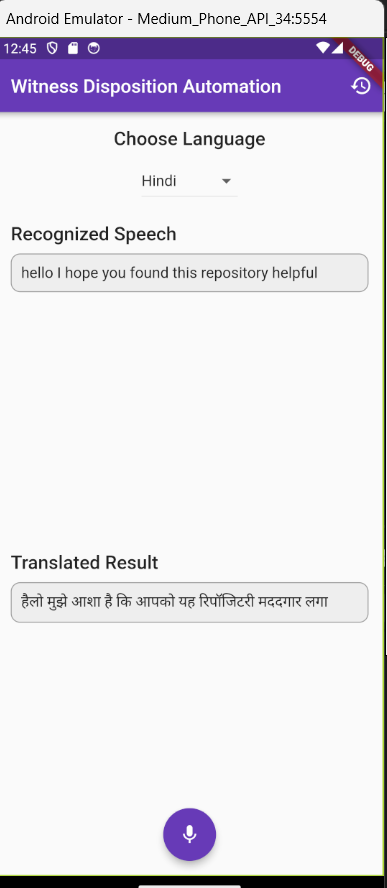

# Witness Disposition Automation App




## Overview

The **Witness Disposition Automation App** is a powerful Flutter-based mobile application designed to streamline and enhance the process of recording, transcribing, and managing witness statements in real-time. With support for multiple user roles, including clients, clerks, and lawyers, the app offers robust features for real-time speech-to-text conversion, multilingual support, and secure data management.

## Features

- **Real-Time Speech-to-Text Conversion** 📄
  - Accurately transcribe witness statements in real-time, ensuring high accuracy and efficiency.

- **Multilingual Support** 🌐
  - Transcribe statements in various Indian regional languages using Azure Speech Service and Bhashini API, making the app accessible to a wider audience.

- **Secure Authentication** 🔒
  - Utilize Firebase Authentication and Two-Factor Authentication to ensure secure access for all users.

- **Translation Services** 🌍
  - Instantly translate transcriptions using the Azure Translator API, facilitating communication across different languages.

- **User Role Management** 👥
  - Separate dashboards for clients, clerks, and lawyers with role-specific features.
  - **Client Dashboard**: View past witness depositions.
  - **Clerk Dashboard**: Add lawyers, search and edit case transcriptions, view analytics.
  - **Lawyer Dashboard**: Manage case transcriptions.

- **Data Storage** 🗄️
  - Securely store all transcriptions and user data in Firebase Firestore.

- **User Profiles and Notifications** 🔔
  - Manage user profiles and receive notifications for important updates.

## Tech Stack

- **Frontend**: Flutter, Dart
- **Backend**: Firebase Authentication, Firebase Firestore, Firebase Storage
- **APIs and Services**: Azure Speech Service, Azure Translator API, Azure OpenAI Service, Bhashini API
- **Cloud Platform**: Microsoft Azure
- **Development Tools**: Visual Studio Code, Android Studio, Git, GitHub

## Getting Started

Follow these steps to set up the project locally:

1. **Clone the Repository**:
   ```sh
   git clone https://github.com/yourusername/witness-disposition-automation-app.git
   cd witness-disposition-automation-app
