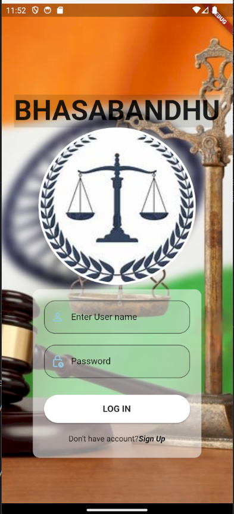

# Witness Disposition Automation App



## Overview

The Witness Disposition Automation App is a Flutter-based mobile application designed to streamline and enhance the process of recording, transcribing, and managing witness statements in real-time. This app supports multiple user roles, including clients, clerks, and lawyers, and provides robust features for real-time speech-to-text conversion, multilingual support, and secure data management.

## Features

- **Real-Time Speech-to-Text Conversion**: Accurately transcribe witness statements in real-time.
- **Multilingual Support**: Supports transcription in various Indian regional languages using Azure Speech Service and Bhashini API.
- **Secure Authentication**: Utilizes Firebase Authentication and Two-Factor Authentication for secure access.
- **Translation Services**: Instantly translate transcriptions using Azure Translator API.
- **User Role Management**: Separate dashboards for clients, clerks, and lawyers with role-specific features.
  - **Client Dashboard**: View past witness depositions.
  - **Clerk Dashboard**: Add lawyers, search and edit case transcriptions, view analytics.
  - **Lawyer Dashboard**: Manage case transcriptions.
- **Data Storage**: Securely store all transcriptions and user data in Firebase Firestore.
- **User Profiles and Notifications**: Manage user profiles and receive notifications.

## Tech Stack

- **Frontend**: Flutter, Dart
- **Backend**: Firebase Authentication, Firebase Firestore, Firebase Storage
- **APIs and Services**: Azure Speech Service, Azure Translator API, Azure OpenAI Service, Bhashini API
- **Cloud Platform**: Microsoft Azure
- **Development Tools**: Visual Studio Code, Android Studio, Git, GitHub

## Getting Started

1. **Clone the Repository**:
   ```sh
   git clone https://github.com/yourusername/witness-disposition-automation-app.git
   cd witness-disposition-automation-app
